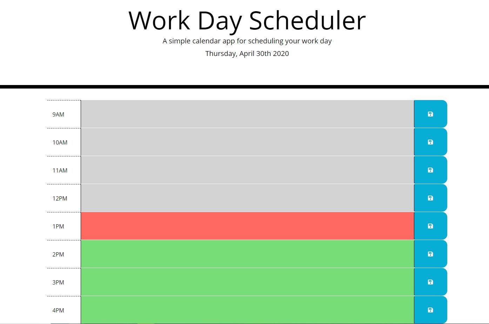

# Work Day Scheduler

A simple calendar application that allows the user to save events for each hour of the day.

## Features

- Displays the current date.
- Divides past hours, current hour, and future hours by color.
- Allows user to store entered schedule information in local storage.

